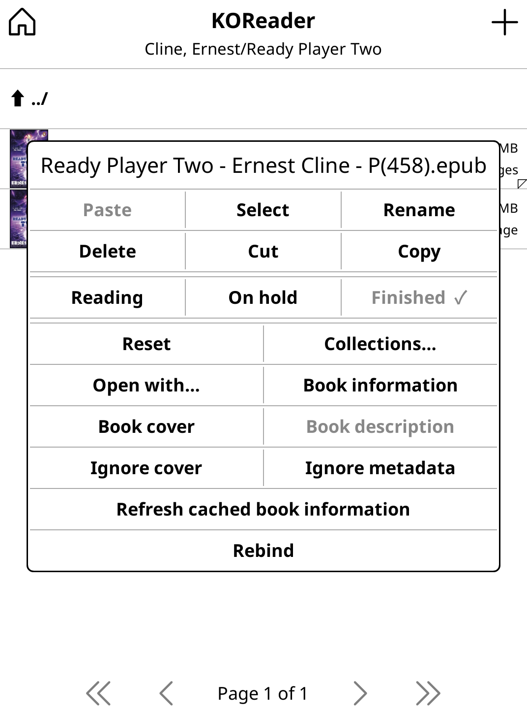
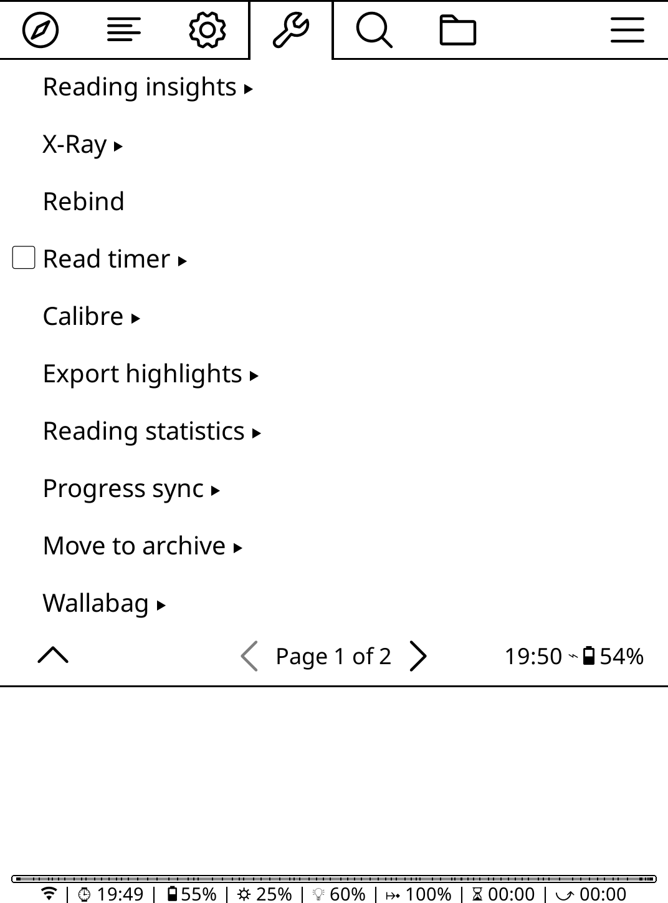
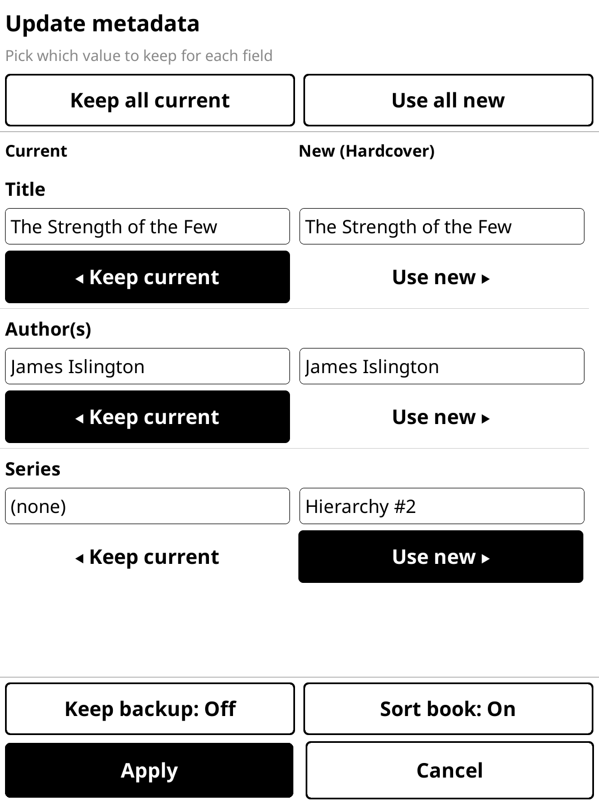
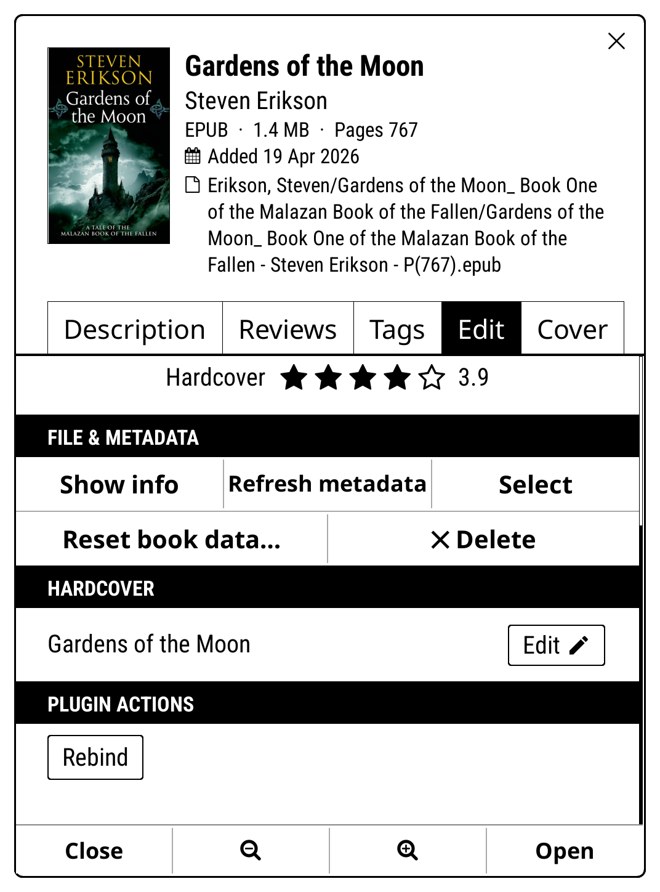

<p align="center">
  
</p>

# Rebind

Fix your EPUBs' embedded metadata (title, author, series, genre, and description) from
[Hardcover](https://hardcover.app), or by typing it yourself, **entirely on your
KOReader device**. Long-press a book, review the current vs. proposed values side by
side, pick what to keep or edit any field by hand, and Rebind rewrites the file in
place (Calibre-style, mutating the OPF). No laptop, no cables, no Calibre round-trip.

<table>
  <tr>
    <td align="center"><br><sub><b>Long-press → Rebind</b></sub></td>
    <td align="center"><br><sub><b>Reader → Tools</b></sub></td>
    <td align="center"><br><sub><b>Pick per field</b></sub></td>
    <td align="center"><br><sub><b>File it away</b></sub></td>
  </tr>
</table>

## Why this is useful

Fixing a book's metadata usually means booting up Calibre on a computer, connecting
or syncing the device, editing there, and copying the file back. Rebind skips all of
that. You edit the embedded metadata **entirely on the device**, right from KOReader,
with no laptop, no cable, and no round-trip.

Because it rewrites the real embedded metadata (not a KOReader-only sidecar), the
corrected title, author, and series travel with the file everywhere: other readers,
Calibre, and any device you copy it to see the same values. And with the optional
sorted-library move, you can look a book up, correct it, and file it away by author
without ever leaving the reader.

## Install

> **Required for lookups: the [Hardcover plugin](https://github.com/billiam/hardcoverapp.koplugin).**
> Rebind reuses that plugin's API client instead of talking to Hardcover directly, so
> to look books up you must install it, **enable** it, and configure its API token by
> following
> [its setup instructions](https://github.com/billiam/hardcoverapp.koplugin#readme)
> (you'll need a token from <https://hardcover.app/account/api>). If Hardcover is
> missing, disabled, or unconfigured, Rebind says so and offers to let you edit the
> book's metadata by hand instead.

1. Copy the `rebind.koplugin` folder into your device's KOReader plugins folder:

   | Device | Plugins folder |
   |--------|----------------|
   | Kindle | `/mnt/us/koreader/plugins/` |
   | Kobo | `/mnt/onboard/.adds/koreader/plugins/` |
   | Android | `<koreader-dir>/plugins/` |
   | Desktop | `~/.config/koreader/plugins/` |

2. Restart KOReader.
3. Enable **Rebind** (menu → gear → **Plugin management**).

Prefer a plugin manager? You can also install and update Rebind from inside KOReader
with [Storefront](https://github.com/ultimatejimmy/storefront.koplugin) or
[App Store](https://github.com/omer-faruq/appstore.koplugin).

---

## A quick tour

### Launching Rebind

There are three ways in, and the menu is a single **Rebind** entry with no submenus,
because everything else is chosen on the rebind screen itself:

- **File browser**: long-press an EPUB → **Rebind**. This works in KOReader's stock
  file browser, and if you use
  [Bookshelf](https://github.com/AndyHazz/bookshelf.koplugin), Rebind is also
  surfaced when you long-press a book (under its **Plugin actions**).
- **While reading**: top menu → **Tools → Rebind** (it sits at the top of Tools).
- **Gesture**: bind the **"Rebind current book"** action to any gesture or tap-zone
  via **Gear → Taps and gestures → Gesture manager**, for one-tap access.

<table>
  <tr>
    <td align="center"><br><sub>Stock file browser</sub></td>
    <td align="center"><br><sub>Bookshelf book menu</sub></td>
  </tr>
</table>

Rebind looks the book up on Hardcover, by ISBN first (read from the EPUB), falling
back to a title + author search. If several matches come back, you pick the right one,
or choose **None of these, edit myself** to fill the fields in by hand instead.

### The metadata picker

The heart of Rebind. Your book's **current** values sit on the left, Hardcover's
**new** values on the right, field by field (title, author, series, genre, description). Tap
**Keep current** or **Use new** per field, or **Keep all current** / **Use all new**
at the top to decide in one go. An empty field (like a missing series) shows `(none)`,
so you can see exactly what Rebind would add. Long descriptions are shortened to a
preview in the picker; the full text is what gets written.

Neither value right? Type your own. **Tap any value** to edit it, or use the **Edit**
button under a field. The editor opens seeded with the value you tapped: a single line
for title, author and genre (separate multiple authors or genres with commas), a name +
index pair for series, and a full-screen editor for the description. Your text then appears as a third
value under the field, with a **Use mine** button to select it, so all three values
stay visible and switchable. Clearing an editor and saving **removes** that metadata
from the book.

The same editors work whenever Hardcover has nothing useful to offer, so no path
dead-ends:

- **No match**: Rebind offers to let you edit the metadata yourself.
- **Wrong matches**: the match list carries a **None of these, edit myself** option.
- **Lookup failed** (no network, API error): choose **Retry** or **Edit myself**.
- **Hardcover plugin missing or unconfigured**: Rebind says what to install and offers
  hand-editing in the meantime.

In each case you get the picker with an empty Hardcover column and every field
editable.

Two toggles in the footer, remembered between runs:

- **Keep backup**: leave a `.rebind.bak` copy of the original next to the book.
- **Sort book**: move the file into your sorted library after applying (below).

Hit **Apply** and Rebind rewrites the file. The library refreshes on its own. If you
rebind the book you're reading, it offers to reopen so the new metadata takes effect.

<p align="center">
  
</p>

### Sorting into folders

Turn on **Sort book** and, after applying, Rebind offers to file the book away. The
first time, it asks for a destination folder, prefilled to your KOReader home folder
and remembered per device. Then you pick the layout:

- **Author / Title / book**: a sorted tree, `<root>/<Author, Surname-first>/<Title>/<file.epub>`
- **Directly in this folder**: just move the file into the chosen folder
- **Keep here**: don't move

The `.sdr` sidecar (reading progress, bookmarks, highlights) travels with the book.
Sort the book you're currently reading and Rebind relocates it and reopens it at the
new path, position intact. Author folders are surname-first (e.g. `Herbert, Frank`),
and folder names are sanitized for filesystem-illegal characters.

<p align="center">
  
</p>

## Safety

Rebind **mutates the EPUB file**, so it works carefully:

- it writes the rewritten EPUB to a temporary file,
- re-opens and validates it (the `mimetype` entry must be first and stored
  uncompressed, and the OPF must still parse),
- copies the original to `<book>.epub.rebind.bak`,
- and only then atomically replaces the original.

The original is never overwritten until the new file is confirmed valid. The backup
is always created for the duration of the swap. Whether it's **kept** afterwards is
the **Keep backup** toggle on the rebind screen (on by default). Turn it off to avoid
`.rebind.bak` files piling up in your library.

Your reading progress, bookmarks, and highlights in the `.sdr` sidecar are left
untouched. After a successful write, Rebind invalidates KOReader's cached book info
(via the `InvalidateMetadataCache` / `BookMetadataChanged` events) so the file
browser shows the new values without a restart.

### What gets written

Only **title, author(s), series, series index, genre(s), and description**. Title,
authors, genres and description are written as their `dc:` elements — genres as
`dc:subject`, the same tags Calibre shows under **Tags**, replacing any existing ones.
Series is written in **both** conventions for maximum compatibility, updating existing
tags in place rather than duplicating them:

- Calibre: `<meta name="calibre:series" .../>` + `calibre:series_index`
- EPUB3: `belongs-to-collection` / `collection-type` / `group-position`

Hardcover ranks genres by popularity; Rebind proposes the **top 5** so the tag list
stays meaningful. Trim or add your own in the editor before applying.

Emptying a field in the editor removes its tags instead of writing them: the `dc:`
element for title, author, genre or description, and both series conventions for
series. `dc:title` is required by the EPUB spec, so a book you deliberately leave
title-less is technically non-conformant (readers fall back to the filename).

The Hardcover plugin's own queries don't return descriptions or genres, so Rebind asks
Hardcover for them itself in a single extra query per lookup. If that query fails,
the rest of the lookup still works, and those fields just show as `(none)`.

**EPUB only.** Other formats (MOBI/AZW3/PDF) are detected and reported as not
supported yet. One book at a time, no batch mode. Covers are not written yet.

## Development

The pure-logic modules (`rebind/epub.lua`, `rebind/fields.lua`, `rebind/hardcover.lua`,
`rebind/organize.lua`) have a zero-dependency test suite that runs on plain LuaJIT or
Lua 5.1, with no luarocks or busted required. It stubs KOReader's `ffi/archiver` with
an in-memory archive, and `gettext` with an identity function.

```
make test      # run the test suite
make package   # run tests, then build dist/rebind.koplugin.zip
make clean     # remove build artifacts
```

`./tests/run.sh` runs the suite directly (it tries `luajit`, `lua5.1`, `lua`, then
`nix run nixpkgs#luajit`). Coverage includes OPF editing (update-in-place, no
duplicate tags, both series conventions, clearing a field), metadata/ISBN extraction,
the field value parsing/formatting behind the editors, the destination path logic, and
the Hardcover lookup/extraction. The UI modules (`main.lua`,
`rebind/ui/diffpicker.lua`) need a live KOReader runtime and are exercised on-device.
`make package` stages only the runtime files under a `rebind.koplugin/` prefix, so
the zip extracts straight into KOReader's `plugins/` directory.

### Releasing

Releases are automated with
[release-please](https://github.com/googleapis/release-please) and driven by
[conventional commits](https://www.conventionalcommits.org/). Merging a commit into
`main` opens a `chore(main): release X.Y.Z` pull request carrying the version bump
and the generated [`CHANGELOG.md`](CHANGELOG.md) entries; merging *that* tags the
release, publishes it, and attaches `dist/rebind.koplugin.zip` to it.

See [`CONTRIBUTING.md`](CONTRIBUTING.md) for the commit conventions and how each
prefix affects the version.

## Credits & license

Rebind is released under the [MIT License](LICENSE).

- Hardcover API client: [`hardcoverapp.koplugin`](https://github.com/billiam/hardcoverapp.koplugin) (MIT).
- OPF XML parsing/serialization: [SLAXML](https://github.com/Phrogz/SLAXML) (MIT),
  vendored under `rebind/vendor/`.
- The side-by-side metadata picker was modelled on the widget composition patterns in
  [`storefront.koplugin`](https://github.com/ultimatejimmy/storefront.koplugin) (MIT)
  by ultimatejimmy.
